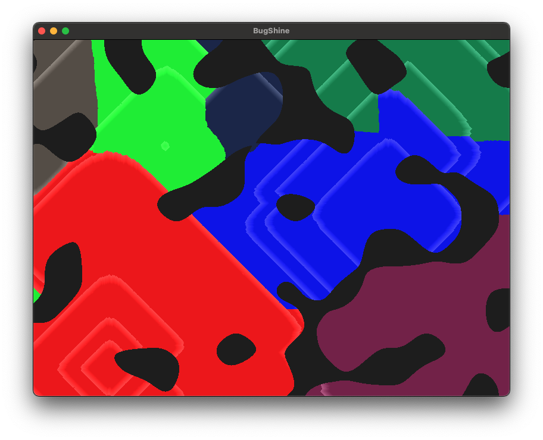

# bug-shine

A weird little game I was thinking about submitting for LudumDare 56. 



Basically, you have simulated 'bugs' which grow on 'shining' expanding paths. You are red, try to take over the world. Your only input is clicking on yourself (the red regions). 

To run:

```bash
cargo run --release
```

It *should* just work(tm). 